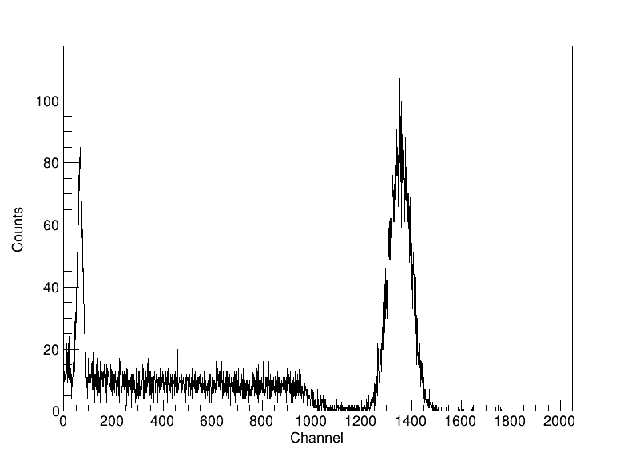
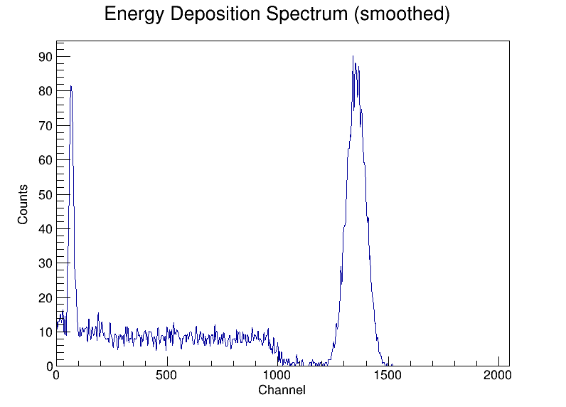

# Geant4_PIPS

Geant4 Monte Carlo simulation of a PIPS (Passivated Implanted Planar Silicon) detector for alpha-particle detection efficiency measurements, alongside a NaI(Tl) scintillator detector for gamma spectroscopy. The primary alpha source is modeled as an Am-241 disc, with the alpha-particle energy deposition spectrum in the Si active layer as the main observable. The scintillator channel scores any particle depositing energy in its active volume, independent of the PIPS channel — useful for gamma-emitting sources like Cs-137. Post-processing and plotting are handled via ROOT.

## Features

- Full radioactive decay chain simulation using `G4RadioactiveDecayPhysics`
- Realistic PIPS detector geometry: 50 nm dead layer + 650 µm active Si layer
- Am-241 source geometry: cylindrical disc + annular frame (G4_Fe encapsulation)
- Scintillator detector: classic 3"x3" NaI(Tl) crystal in an Al housing, scored independently of PIPS
- Multi-threaded simulation (16 threads via Geant4 MT)
- Automatic post-processing: per-thread CSV merge → binned spectra → PNG plots, for both PIPS and the scintillator
- Electronics/detector broadening model per detector: Gaussian smearing with Fano noise for PIPS, photon-statistics scaling law for the scintillator (calibrated to a published 3"x3" NaI(Tl) spec)

## Dependencies

- [Geant4](https://geant4.org/) (tested with 11.3.2), built with `ui_all` and `vis_all`
- [ROOT](https://root.cern/) (tested with 6.x)
- CMake ≥ 3.16
- C++17 or later

## Build

Out-of-source CMake build is required. Source Geant4 and ROOT environments before building.

```bash
source /path/to/geant4/bin/geant4.sh
source /path/to/root/bin/thisroot.sh

mkdir build && cd build
cmake ..
make -j$(nproc)
```

The executable `G4Decay` and all `.mac` files are placed in the build directory.

## Usage

### Interactive mode (visualization)

```bash
./G4Decay
```

Loads `vis.mac` automatically and opens the OGL viewer.

> **Wayland users:** if the visualization window appears blank, set the following before running:
> ```bash
> export XDG_SESSION_TYPE=x11
> ```

### Batch mode

```bash
./G4Decay <macro.mac> <N_events> <Z> <A>
```

| Argument | Description |
|---|---|
| `macro.mac` | Macro file defining source geometry and run settings |
| `N_events` | Number of primary ions to simulate |
| `Z` | Atomic number of the source isotope |
| `A` | Mass number of the source isotope |

Example — 10000 Am-241 decays using `run3.mac`:
```bash
./G4Decay run3.mac 10000 95 241
```

Example — 10000 Po-218 decays using `run3_3.mac` (3 spot sources):
```bash
./G4Decay run3_3.mac 10000 84 218
```

Example — 100000 Cs-137 decays aimed at the scintillator:
```bash
./G4Decay run_cs137_scint.mac 100000 55 137
```

> **Note:** each run starts by deleting all `*.png`, `*.dat`, and `*.csv` files in the working directory.

### Output files

| File | Description |
|---|---|
| `output_nt_Scoring_t*.csv` | Per-thread n-tuple, columns `Edep` (PIPS, MeV) and `EdepScint` (scintillator, MeV) |
| `merge.csv` | Merged n-tuple from all threads |
| `output.dat` | Per-run PIPS histogram from `MyRunAction` — **broken under MT** (see Known issues) |
| `output_fin.dat` | Final PIPS spectrum after electronics broadening, 2048 channels over 3–15 MeV |
| `output_fin_Scint.dat` | Final scintillator spectrum after broadening, 2048 channels over 0–1 MeV |
| `total_energy.dat` | Total deposited energy and kerma in the PIPS scoring volume |
| `EnergyDeposition.png` | Plot of `output_fin.dat` (PIPS, full range) |
| `EnergyDepositionScint.png` | Plot of `output_fin_Scint.dat` (scintillator, full range) |
| `EnergyDepositionScint_smooth.png` | Same data, smoothed with ROOT's `TH1::Smooth()` (5 passes of "353QH, twice") |

## Macro files

| Macro | Source position | Source radius | Notes |
|---|---|---|---|
| `run3.mac` | z = −1.5 mm | 3.15 mm | Single disc source, matches Am geometry |
| `run3_3.mac` | z = −1.5 mm | 3 spot sources at r = 3.4 mm | Triangular arrangement |
| `run1.mac` | z = −0.5 mm | 3 mm | Alternative distance |
| `run2.mac` | z = −11 mm | — | Gamma sources (3-spot, not for alpha runs) |
| `run3_6.mac` | z = −11 mm | 6 spot sources | Sources outside Am geometry — alphas blocked |
| `run3_12.mac` | z = −11 mm | 12 spot sources | Sources outside Am geometry — alphas blocked |
| `run_cs137_scint.mac` | z = +50 mm | 3 mm | Cs-137 ion source aimed at the scintillator; decays via Ba-137m to the 661.7 keV gamma line. No PIPS-relevant emission |
| `vis.mac` | — | — | Interactive visualization |

All batch macros use 16 threads and `G4GeneralParticleSource`. The isotope and event count are passed via command-line aliases `{Znum}`, `{Anum}`, `{NumberOfParticles}`.

## Detector geometry

```
z = −2.5 mm   Am-241 disc (G4_Fe, r = 20 mm, dz = 2 mm)
z = −0.75 mm  Am-241 frame (G4_Fe, annular r = 8–20 mm, dz = 1.5 mm)
z =  0 mm     Si dead layer (50 nm)
z = +0.325 mm Si active layer / scoring volume (650 µm, r = 10 mm)  ← Edep recorded here
z = +100 mm   NaI(Tl) scintillator (Al housing, with a 1.5 mm air gap around the crystal)
```

All volumes are placed in air (G4_AIR). An ICRU sphere at z = +1 m is included for dosimetry cross-checks.

### Scintillator crystal

A classic 3"x3" cylindrical NaI(Tl) crystal, wrapped in a thin Al housing via a `G4SubtractionSolid`:

```
Crystal radius / length:  38.1 mm / 76.2 mm (3" diameter x 3" length)
Reflector gap (air):      1.5 mm
Housing wall (G4_Al):     0.5 mm
```

Only the crystal itself is scored (`fScoringVolumeScint`); the housing is structural only. Unlike PIPS (alpha only), the scintillator channel scores energy from any particle. Crystal and housing are placed as siblings directly in `logicVacuum`, 100 mm from the world origin — no separate gap volume is needed since the reflector gap medium (air) matches the surrounding vacuum-box material.

## Electronics broadening

PIPS energy is smeared with a Gaussian to simulate the combined detector and electronics resolution:

$$\mathrm{FWHM}(E) = \sqrt{\mathrm{FWHM_{noise}}^2 + 2.355^2 \cdot F \cdot \varepsilon \cdot E}$$

| Parameter | Value | Description |
|---|---|---|
| FWHM_noise | 15 keV (default) | Electronics noise contribution |
| F | 0.12 | Si Fano factor |
| ε | 3.62 eV | Si ionization energy per e-h pair |

The scintillator uses a different model, since NaI(Tl) resolution is dominated by photon-collection statistics rather than a Fano-type intrinsic term. Resolution scales as $1/\sqrt{E}$ from a reference point:

$$\mathrm{FWHM}(E) = R_{662} \cdot \sqrt{E_{ref} \cdot E}, \quad E_{ref} = 662\ \mathrm{keV}$$

`R_662 = 0.075` (7.5%) is calibrated to OST Photonics' published 3"x3" NaI(Tl) spec: FWHM ≤ 7.5% at 662 keV (Cs-137), the industry-standard reference point for this detector size.

Both parameters can be adjusted in `csv_to_dat()` in [g4decay.cc](g4decay.cc).

### Example spectra

10000 Po-218 decays simulated with `run3_3.mac`, shown at three PIPS `FWHM_noise` settings:

| FWHM_noise = 15 keV (default) | FWHM_noise = 150 keV | FWHM_noise = 500 keV |
|---|---|---|
|  |  |  |

As `FWHM_noise` increases, the alpha peak flattens and broadens while the total event count is conserved.

For the scintillator, the physical FWHM at 662 keV (~50 keV) is much larger than HPGe's (~1-2 keV), so the peak is visibly broad even in the full-spectrum plot:

100000 Cs-137 decays via `run_cs137_scint.mac` — the broad 661.7 keV photopeak, noticeably rougher and wider than an HPGe photopeak at the same energy:

| Raw | Smoothed (`EnergyDepositionScint_smooth.png`) |
|---|---|
|  |  |

The smoothed version applies ROOT's `TH1::Smooth()` (5 passes of the "353QH, twice" algorithm — a resistant running-median smoother that tames single-channel Poisson noise without shifting the peak position or eroding its shape) purely for visualization; `output_fin_Scint.dat` itself is never modified.

## Physics list

| Module | Purpose |
|---|---|
| `G4EmStandardPhysics` | Electromagnetic interactions (ionization, multiple scattering) |
| `G4OpticalPhysics` | Optical photon transport |
| `G4DecayPhysics` | Particle decays |
| `G4RadioactiveDecayPhysics` | Radioactive decay chains |

The radioactive decay time threshold is set in `main()` via `SetTimeThresholdForRadioactiveDecay`, currently 1000 years. Nuclides with a half-life above this threshold are treated as stable and never decay in the simulation, so this value must stay comfortably above the half-life of the isotope being simulated. It was previously 200 days, which silently produced zero counts for Am-241 (T½ = 432 years) and Cs-137 (T½ = 30.17 years) — only short-lived isotopes like Po-218 (T½ = 3.05 min) worked. 1000 years covers all isotopes currently used in this repo; short-lived isotopes are unaffected either way.

## Known issues

- **`output.dat` is always empty under MT.** `MyRunAction::BeginOfRunAction`/`EndOfRunAction` also run on the master thread's own `MyRunAction` instance, whose `globalHistogram` is never filled (the master doesn't process events). Its `EndOfRunAction` runs last and overwrites `output.dat` with all zeros. Use `output_fin.dat` / `output_fin_Scint.dat` (the n-tuple/CSV path) instead — verified reliable.
- **`run3.mac`'s Am-241 source sits exactly on the Am disc's front-face boundary** (z = −1.5 mm), which can produce inconsistent touchable resolution at the boundary. Prefer `run3_3.mac` (also z = −1.5 mm, but 3 off-center spot sources) for Am-241/alpha runs.
