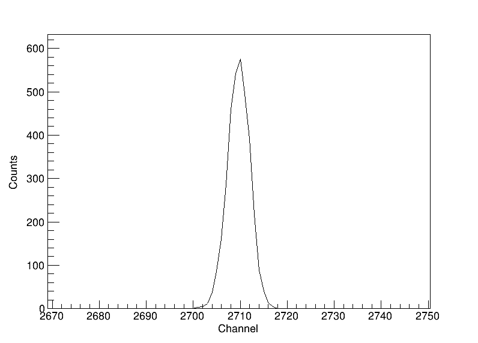
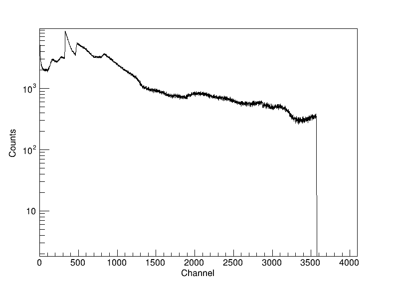
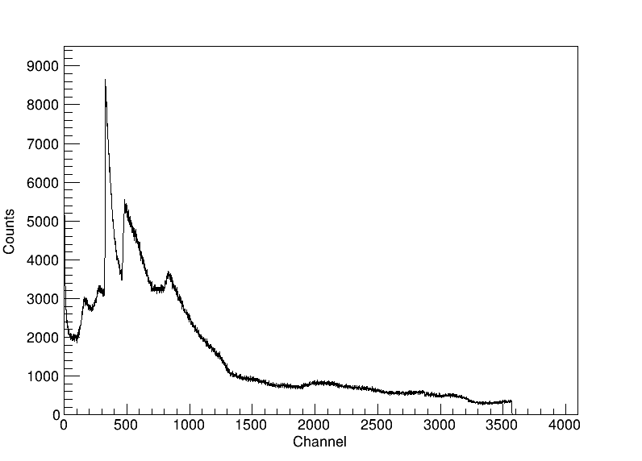
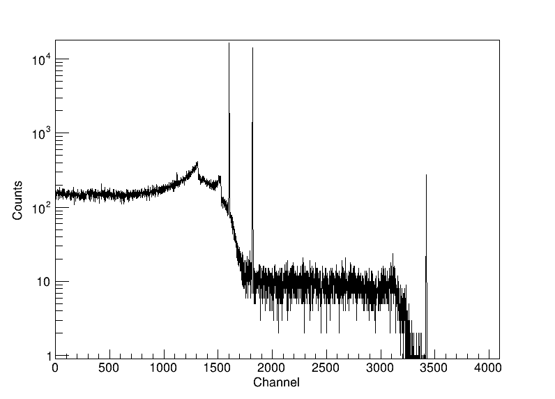
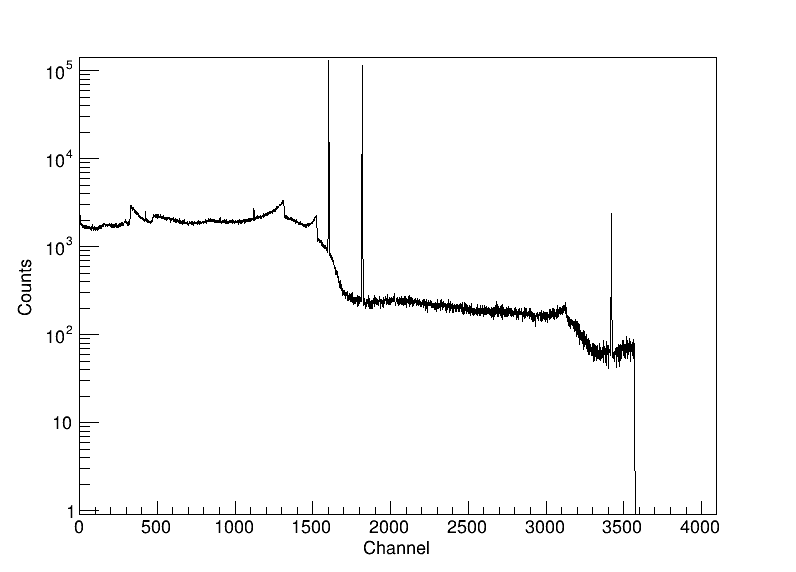
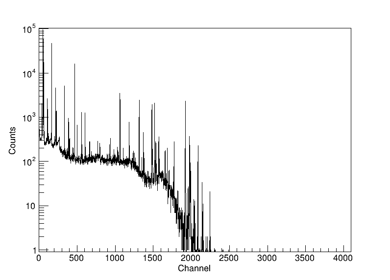
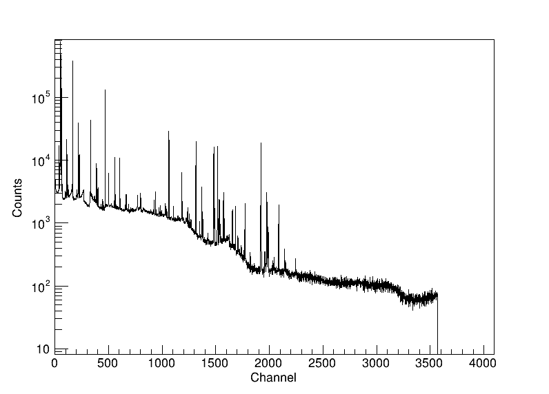
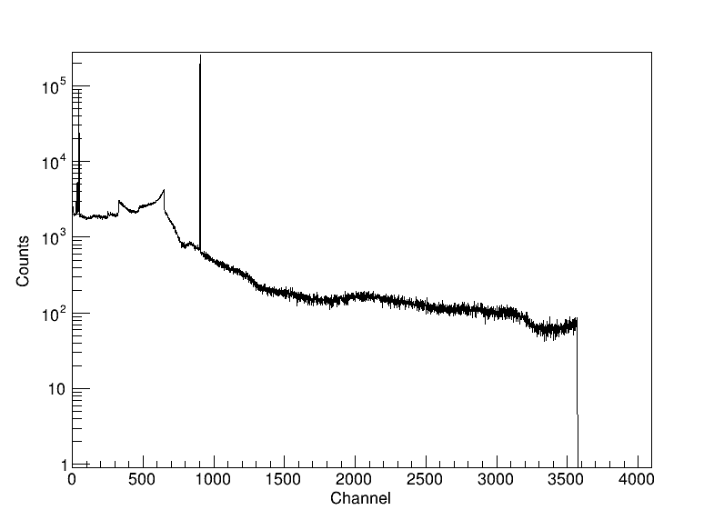

# Geant4_PIPS

Geant4 Monte Carlo simulation of a PIPS (Passivated Implanted Planar Silicon) detector for alpha-particle detection efficiency measurements, alongside an HPGe (High-Purity Germanium) detector for gamma spectroscopy. The primary alpha source is modeled as an Am-241 disc, with the alpha-particle energy deposition spectrum in the Si active layer as the main observable. The HPGe channel scores any particle depositing energy in its active volume, independent of the PIPS channel — useful for gamma-emitting sources like Cs-137. Post-processing and plotting are handled via ROOT.

## Features

- Full radioactive decay chain simulation using `G4RadioactiveDecayPhysics`
- Realistic PIPS detector geometry: 50 nm dead layer + 650 µm active Si layer
- Am-241 source geometry: cylindrical disc + annular frame (G4_Fe encapsulation)
- HPGe detector: p-type closed-end coaxial Ge crystal with bore, n+/p+ contact layers, and Al end cap, scored independently of PIPS
- Multi-threaded simulation (16 threads via Geant4 MT)
- Automatic post-processing: per-thread CSV merge → binned spectra → PNG plots, for both PIPS and HPGe
- Electronics broadening model per detector: Gaussian smearing with Fano noise + configurable electronics noise FWHM (HPGe calibrated to published ORTEC GEM40 specs)
- Auto-zoomed peak plot for HPGe to visualize Gaussian broadening at a glance

## Dependencies

- [Geant4](https://geant4.org/) (tested with 11.3.2), built with `ui_all` and `vis_all`
- [ROOT](https://root.cern/) (tested with 6.x)
- CMake ≥ 3.16
- C++17 or later

## Build

Out-of-source CMake build is required. Source Geant4 and ROOT environments before building.

```bash
source /path/to/geant4/bin/geant4.sh
source /path/to/root/bin/thisroot.sh

mkdir build && cd build
cmake ..
make -j$(nproc)
```

The executable `G4Decay` and all `.mac` files are placed in the build directory.

## Usage

### Interactive mode (visualization)

```bash
./G4Decay
```

Loads `vis.mac` automatically and opens the OGL viewer.

> **Wayland users:** if the visualization window appears blank, set the following before running:
> ```bash
> export XDG_SESSION_TYPE=x11
> ```

### Batch mode

```bash
./G4Decay <macro.mac> <N_events> <Z> <A>
```

| Argument | Description |
|---|---|
| `macro.mac` | Macro file defining source geometry and run settings |
| `N_events` | Number of primary ions to simulate |
| `Z` | Atomic number of the source isotope |
| `A` | Mass number of the source isotope |

Example — 10000 Am-241 decays using `run3.mac`:
```bash
./G4Decay run3.mac 10000 95 241
```

Example — 10000 Po-218 decays using `run3_3.mac` (3 spot sources):
```bash
./G4Decay run3_3.mac 10000 84 218
```

Example — 100000 Cs-137 decays aimed at the HPGe crystal:
```bash
./G4Decay run_cs137_hpge.mac 100000 55 137
```

> **Note:** each run starts by deleting all `*.png`, `*.dat`, and `*.csv` files in the working directory.

### Output files

| File | Description |
|---|---|
| `output_nt_Scoring_t*.csv` | Per-thread n-tuple, columns `Edep` (PIPS, MeV) and `EdepHPGe` (HPGe, MeV) |
| `merge.csv` | Merged n-tuple from all threads |
| `output.dat` | Per-run PIPS histogram from `MyRunAction` — **broken under MT** (see Known issues) |
| `output_fin.dat` | Final PIPS spectrum after electronics broadening, 2048 channels over 3–15 MeV |
| `output_fin_HPGe.dat` | Final HPGe spectrum after electronics broadening, 4096 channels over 0–3 MeV |
| `total_energy.dat` | Total deposited energy and kerma in the PIPS scoring volume |
| `EnergyDeposition.png` | Plot of `output_fin.dat` (PIPS, full range) |
| `EnergyDepositionHPGe.png` | Plot of `output_fin_HPGe.dat` (HPGe, full range, linear y-axis) |
| `EnergyDepositionHPGe_log.png` | Same HPGe data, log y-axis (matches how published background spectra are usually shown) |
| `EnergyDepositionHPGe_peak.png` | Same HPGe data, auto-zoomed ±40 channels around the tallest peak |

## Macro files

| Macro | Source position | Source radius | Notes |
|---|---|---|---|
| `run3.mac` | z = −1.5 mm | 3.15 mm | Single disc source, matches Am geometry |
| `run3_3.mac` | z = −1.5 mm | 3 spot sources at r = 3.4 mm | Triangular arrangement |
| `run1.mac` | z = −0.5 mm | 3 mm | Alternative distance |
| `run2.mac` | z = −11 mm | — | Gamma sources (3-spot, not for alpha runs) |
| `run3_6.mac` | z = −11 mm | 6 spot sources | Sources outside Am geometry — alphas blocked |
| `run3_12.mac` | z = −11 mm | 12 spot sources | Sources outside Am geometry — alphas blocked |
| `run_hpge_gamma.mac` | z = −1.5 mm | 3 mm | Direct 59.5 keV gamma source aimed at HPGe, bypassing decay physics — for validating HPGe geometry/scoring in isolation |
| `run_cs137_hpge.mac` | z = +50 mm | 3 mm | Cs-137 ion source aimed at HPGe; decays via Ba-137m to the 661.7 keV gamma line. No PIPS-relevant emission |
| `run_hpge_background.mac` | z = +50 mm | 3 mm | Illustrative "shield background" spectrum: one gamma source emitting a discrete mix of ~16 natural background lines (U-238/Th-232 chain daughters, K-40, 511 keV annihilation) via `/gps/ene/type Arb`, weighted by approximate photon yield. See below |
| `run_co60_hpge.mac` | z = +50 mm | 3 mm | Co-60 ion source aimed at HPGe (real decay physics); the 1173.2/1332.5 keV cascade shows up with the classic ~2505.7 keV coincidence sum peak. See below |
| `run_hpge_background_co60.mac` | z = +50 mm | 3 mm | `run_hpge_background.mac`'s line mix plus a real Co-60 decay source (GPS multi-source, relative intensity 1:4) — e.g. a Co-60 check source measured with ambient background present. See below |
| `run_eu152_hpge.mac` | z = +50 mm | 3 mm | Eu-152 ion source aimed at HPGe (real decay physics); ~12 significant gamma lines from 122–1408 keV, the classic multi-line HPGe efficiency-calibration source. See below |
| `run_hpge_background_eu152.mac` | z = +50 mm | 3 mm | `run_hpge_background.mac`'s line mix plus a real Eu-152 decay source (GPS multi-source, relative intensity 1:4). See below |
| `run_hpge_background_cs137.mac` | z = +50 mm | 3 mm | `run_hpge_background.mac`'s line mix plus a real Cs-137 decay source (GPS multi-source, relative intensity 1:4) — e.g. a Cs-137 check source measured with ambient background present. See below |
| `vis.mac` | — | — | Interactive visualization |

All batch macros use 16 threads and `G4GeneralParticleSource`. The isotope and event count are passed via command-line aliases `{Znum}`, `{Anum}`, `{NumberOfParticles}`.

## Detector geometry

```
z = −2.5 mm   Am-241 disc (G4_Fe, r = 20 mm, dz = 2 mm)
z = −0.75 mm  Am-241 frame (G4_Fe, annular r = 8–20 mm, dz = 1.5 mm)
z =  0 mm     Si dead layer (50 nm)
z = +0.325 mm Si active layer / scoring volume (650 µm, r = 10 mm)  ← Edep recorded here
z = +100 mm   HPGe end cap (Al, with a 5 mm vacuum gap around the crystal)
```

All volumes are placed in air (G4_AIR). An ICRU sphere at z = +1 m is included for dosimetry cross-checks.

### HPGe crystal

A p-type closed-end coaxial HPGe crystal, built via two nested `G4SubtractionSolid`s sharing one origin:

```
Crystal outer radius:     30 mm
Crystal length:           60 mm
Bore radius / depth:      5 mm / 50 mm (opens at the back face, leaves a 10 mm solid front end)
Outer p+ contact (dead):  0.3 µm, uniformly shrinks the outer surface
Inner n+ contact (dead):  0.5 mm, lines the bore
```

Only the crystal minus both contact layers is scored (`fScoringVolumeHPGe`). The crystal sits in a G4_Al end cap with a 5 mm vacuum gap on all sides, 100 mm from the world origin. Unlike PIPS (alpha only), the HPGe channel scores energy from any particle.

## Electronics broadening

The post-processing step applies a Gaussian smearing to each event energy, independently per detector, to simulate the combined detector and electronics resolution:

$$\mathrm{FWHM}(E) = \sqrt{\mathrm{FWHM_{noise}}^2 + 2.355^2 \cdot F \cdot \varepsilon \cdot E}$$

| Parameter | PIPS (Si) | HPGe (Ge) | Description |
|---|---|---|---|
| FWHM_noise | 15 keV (default) | 0.65 keV | Electronics noise contribution |
| F | 0.12 | 0.13 | Fano factor |
| ε | 3.62 eV | 2.96 eV | Ionization energy per e-h pair |

`FWHM_noise_HPGe` is calibrated to ORTEC's published GEM40 warranted resolution specs (GEM Series Product Configuration Guide): 0.87 keV FWHM at 122 keV, 1.8 keV FWHM at 1.33 MeV (Co-60). Solving for the noise term from each spec point independently gives ~0.63–0.70 keV; 0.65 keV reproduces both within ~5%.

Both parameters can be adjusted in `csv_to_dat()` in [g4decay.cc](g4decay.cc).

### Example spectra

10000 Po-218 decays simulated with `run3_3.mac`, shown at three PIPS `FWHM_noise` settings:

| FWHM_noise = 15 keV (default) | FWHM_noise = 150 keV | FWHM_noise = 500 keV |
|---|---|---|
|  |  |  |

As `FWHM_noise` increases, the alpha peak flattens and broadens while the total event count is conserved.

For HPGe, the physical FWHM at typical gamma energies (~1–2 keV) is small relative to the full 0–3 MeV / 4096-channel range, so the full-spectrum plot renders the peak as a sliver. `EnergyDepositionHPGe_peak.png` auto-zooms ±40 channels around the tallest bin to make the Gaussian shape visible, without altering the underlying data:

> **Note:** the range was widened back from 0–1 MeV to 0–3 MeV on this branch to fit `run_hpge_background.mac`'s lines up to 2.6 MeV (see below); this diverges from `feature/hpge-detector`, where it's 0–1 MeV.

100000 Cs-137 decays via `run_cs137_hpge.mac` — the 661.7 keV photopeak:



## Background spectrum approximation

`run_hpge_background.mac` illustrates a shielded HPGe "background" spectrum — the kind published in low-background/rare-event-search papers, showing many discrete natural-radioactivity lines superimposed on a falling continuum. It does **not** model the actual physical origin of that continuum (trace U/Th/K activity in shield materials, cosmic-ray-induced background) — that would need activation physics and a muon shower generator this project doesn't implement. Instead, a single `/gps/ene/type Arb` source emits a discrete mix of ~16 of the most prominent natural background lines (Pb-212/Pb-214/Bi-214/Ac-228/Tl-208 from the U-238 and Th-232 decay chains, K-40, and 511 keV annihilation), weighted by approximate photon yield per 100 decays. The falling Compton-continuum shape emerges "for free" from each line's own partial-energy-deposit tail in the HPGe crystal — with 16 lines spread from 239 keV to 2.6 MeV, their continua stack into a quasi-continuous background, just as in a real spectrum.

20 million events via `run_hpge_background.mac`, plotted with `nnHPGeLog()` (log y-axis, matching how published background spectra are usually shown) and the standard linear `nnHPGe()`:

| Log scale (`EnergyDepositionHPGe_log.png`) | Linear scale (`EnergyDepositionHPGe.png`) |
|---|---|
|  |  |

Sharp lines are visible at the low-energy end (Pb-212 238.6 keV, Pb-214 351.9 keV, Bi-214 609.3 keV); higher-energy lines are progressively harder to resolve against the accumulated continuum from everything above them — the same effect seen in real background spectra, where a line's visibility depends on how much higher-energy activity is also present.

### Adding a Co-60 source

`run_co60_hpge.mac` layers a genuine Co-60 decay on top: unlike the background lines (each an independent `/gps/ene/type Arb` draw, one photon per event), Co-60 is simulated as a real ion source (`/gps/ion 27 60`), so both cascade photons (1173.2 and 1332.5 keV, near-100% coincident) are tracked within the same event. This reproduces a real, well-known feature that the Arb-histogram approach cannot: the **~2505.7 keV coincidence sum peak**, seen when both photons deposit their full energy in the same event.

2,000,000 events via `run_co60_hpge.mac` (isolated, no background mixed in) — the 1173/1332 keV doublet plus the small sum peak just below 2506 keV:



`run_hpge_background_co60.mac` combines both: the background line mix (as above) plus the same real Co-60 decay source, via GPS multi-source (`/gps/source/add`) at relative intensity 1:4 — approximating a Co-60 check source being measured with ambient background still present. 20,000,000 events:



The Co-60 doublet now towers ~2 orders of magnitude above the background continuum (as a strong calibration source would), while the natural background lines remain visible underneath, and the sum peak is still distinguishable near the high-energy end, just below the background's own Tl-208 2614 keV line.

### Adding an Eu-152 source

`run_eu152_hpge.mac` uses real Eu-152 decay physics (`/gps/ion 63 152`) the same way — Eu-152 decays via EC (72.1%) to Sm-152 and beta- (27.9%) to Gd-152, producing ~12 significant gamma lines from 122 to 1408 keV. It's the classic multi-line source used to calibrate HPGe detector efficiency across a wide energy range, precisely because it has so many well-characterized lines in one measurement.

2,000,000 events via `run_eu152_hpge.mac` (isolated) — all 12 expected lines present with peak-to-baseline ratios from ~5x up to ~800x:



`run_hpge_background_eu152.mac` layers this on the same natural background line mix (relative intensity 1:4, background:Eu-152). 20,000,000 events:



The Eu-152 "forest of lines" stands clearly above the background continuum across the full range, with the background's own Tl-208 2614 keV line still visible marking the spectrum's high-energy end (Eu-152's own lines don't reach that far).

### Adding a Cs-137 source

`run_hpge_background_cs137.mac` layers the real Cs-137 decay from `run_cs137_hpge.mac` (see the Electronics broadening section above) on the same natural background line mix (relative intensity 1:4, background:Cs-137). 20,000,000 events:



The 661.7 keV photopeak dominates ~2 orders of magnitude above the continuum, the Ba K-shell X-ray peak (~32-37 keV, from internal conversion) is visible at the low-energy end alongside the background's own lines, and the background's Tl-208 2614 keV line still marks the high-energy endpoint.

## Physics list

| Module | Purpose |
|---|---|
| `G4EmStandardPhysics` | Electromagnetic interactions (ionization, multiple scattering) |
| `G4OpticalPhysics` | Optical photon transport |
| `G4DecayPhysics` | Particle decays |
| `G4RadioactiveDecayPhysics` | Radioactive decay chains |

The radioactive decay time threshold is set in `main()` via `SetTimeThresholdForRadioactiveDecay`, currently 1000 years. Nuclides with a half-life above this threshold are treated as stable and never decay in the simulation, so this value must stay comfortably above the half-life of the isotope being simulated. It was previously 200 days, which silently produced zero counts for Am-241 (T½ = 432 years) and Cs-137 (T½ = 30.17 years) — only short-lived isotopes like Po-218 (T½ = 3.05 min) worked. 1000 years covers all isotopes currently used in this repo; short-lived isotopes are unaffected either way.

## Known issues

- **`output.dat` is always empty under MT.** `MyRunAction::BeginOfRunAction`/`EndOfRunAction` also run on the master thread's own `MyRunAction` instance, whose `globalHistogram` is never filled (the master doesn't process events). Its `EndOfRunAction` runs last and overwrites `output.dat` with all zeros. Use `output_fin.dat` / `output_fin_HPGe.dat` (the n-tuple/CSV path) instead — verified reliable.
- **`run3.mac`'s Am-241 source sits exactly on the Am disc's front-face boundary** (z = −1.5 mm), which can produce inconsistent touchable resolution at the boundary. Prefer `run3_3.mac` (also z = −1.5 mm, but 3 off-center spot sources) for Am-241/alpha runs.
