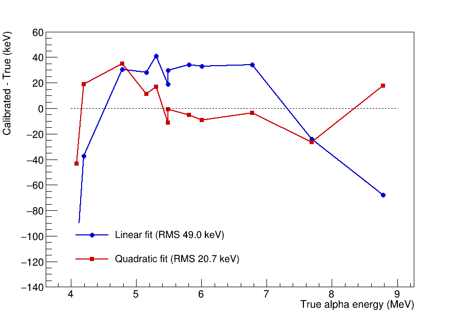
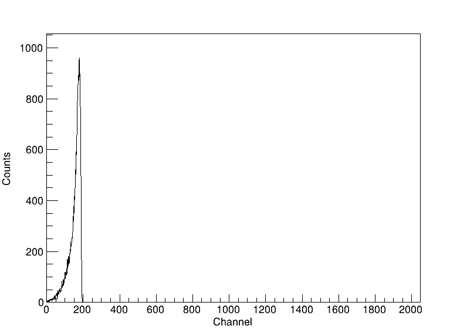
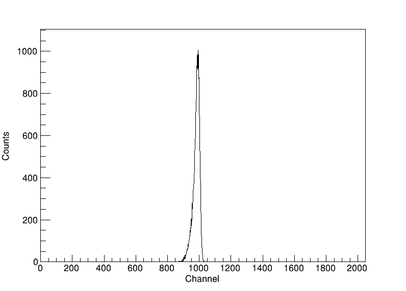
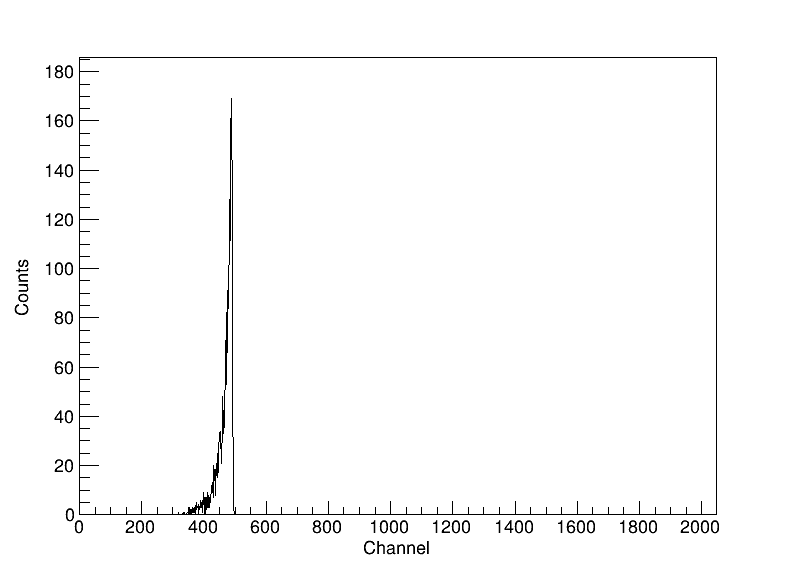
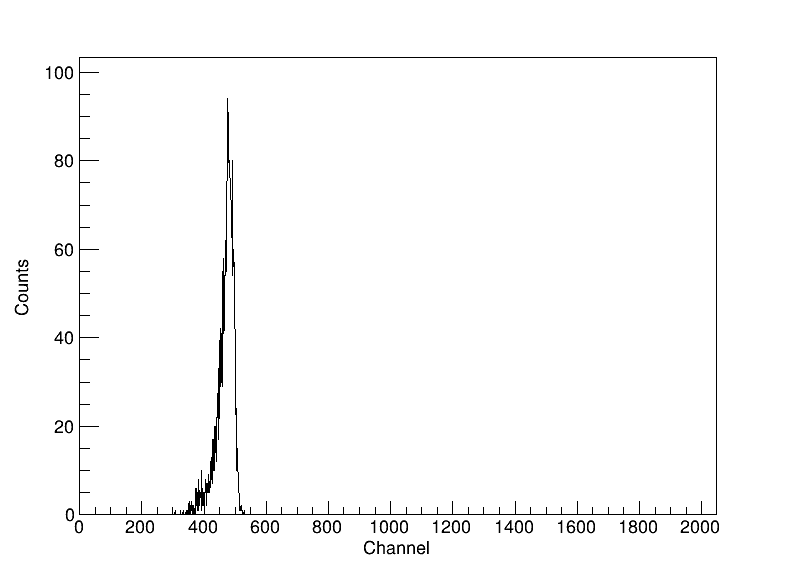
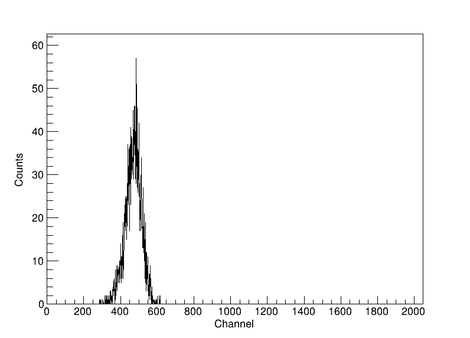

# Geant4_PIPS

Geant4 Monte Carlo simulation of a PIPS (Passivated Implanted Planar Silicon) detector for alpha-particle detection efficiency measurements. The primary source is modeled as an Am-241 disc, and the main observable is the alpha-particle energy deposition spectrum in the Si active layer. Post-processing and plotting are handled via ROOT.

## Features

- Full radioactive decay chain simulation using `G4RadioactiveDecayPhysics`
- Realistic PIPS detector geometry: 50 nm dead layer + 650 µm active Si layer
- Am-241 source geometry: cylindrical disc + annular frame (G4_Fe encapsulation)
- Multi-threaded simulation (16 threads via Geant4 MT)
- Automatic post-processing: per-thread CSV merge → 2048-channel spectrum → PNG plot
- Electronics broadening model: Gaussian smearing with Fano noise + configurable electronics noise FWHM
- PIPS dead-layer energy calibration: quadratic correction (derived from a 12-isotope, 4.08-8.78 MeV sweep) mapping raw deposited energy back to true incident energy

## Dependencies

- [Geant4](https://geant4.org/) (tested with 11.3.2), built with `ui_all` and `vis_all`
- [ROOT](https://root.cern/) (tested with 6.x)
- CMake ≥ 3.16
- C++17 or later

## Build

Out-of-source CMake build is required. Source Geant4 and ROOT environments before building.

```bash
source /path/to/geant4/bin/geant4.sh
source /path/to/root/bin/thisroot.sh

mkdir build && cd build
cmake ..
make -j$(nproc)
```

The executable `G4Decay` and all `.mac` files are placed in the build directory.

## Usage

### Interactive mode (visualization)

```bash
./G4Decay
```

Loads `vis.mac` automatically and opens the OGL viewer.

> **Wayland users:** if the visualization window appears blank, set the following before running:
> ```bash
> export XDG_SESSION_TYPE=x11
> ```

### Batch mode

```bash
./G4Decay <macro.mac> <N_events> <Z> <A>
```

| Argument | Description |
|---|---|
| `macro.mac` | Macro file defining source geometry and run settings |
| `N_events` | Number of primary ions to simulate |
| `Z` | Atomic number of the source isotope |
| `A` | Mass number of the source isotope |

Example — 10000 Am-241 decays using `run3.mac`:
```bash
./G4Decay run3.mac 10000 95 241
```

Example — 10000 Po-218 decays using `run3_3.mac` (3 spot sources):
```bash
./G4Decay run3_3.mac 10000 84 218
```

> **Note:** each run starts by deleting all `*.png`, `*.dat`, and `*.csv` files in the working directory.

### Output files

| File | Description |
|---|---|
| `output_nt_Scoring_t*.csv` | Per-thread n-tuple (raw Edep per event, MeV) |
| `merge.csv` | Merged n-tuple from all threads |
| `output.dat` | 2048-channel histogram from `MyRunAction` (no smearing) |
| `output_fin.dat` | Final spectrum after electronics broadening (channel, counts) |
| `total_energy.dat` | Total deposited energy and kerma in the scoring volume |
| `EnergyDeposition.png` | Plot of `output_fin.dat` |

## Macro files

| Macro | Source position | Source radius | Notes |
|---|---|---|---|
| `run3.mac` | z = −1.5 mm | 3.15 mm | Single disc source, matches Am geometry |
| `run3_3.mac` | z = −1.5 mm | 3 spot sources at r = 3.4 mm | Triangular arrangement |
| `run1.mac` | z = −0.5 mm | 3 mm | Alternative distance |
| `run2.mac` | z = −11 mm | — | Gamma sources (3-spot, not for alpha runs) |
| `run3_6.mac` | z = −11 mm | 6 spot sources | Sources outside Am geometry — alphas blocked |
| `run3_12.mac` | z = −11 mm | 12 spot sources | Sources outside Am geometry — alphas blocked |
| `vis.mac` | — | — | Interactive visualization |

All batch macros use 16 threads and `G4GeneralParticleSource`. The isotope and event count are passed via command-line aliases `{Znum}`, `{Anum}`, `{NumberOfParticles}`.

## Detector geometry

```
z = −2.5 mm   Am-241 disc (G4_Fe, r = 20 mm, dz = 2 mm)
z = −0.75 mm  Am-241 frame (G4_Fe, annular r = 8–20 mm, dz = 1.5 mm)
z =  0 mm     Si dead layer (50 nm)
z = +0.325 mm Si active layer / scoring volume (650 µm, r = 10 mm)  ← Edep recorded here
```

All volumes are placed in air (G4_AIR). An ICRU sphere at z = +1 m is included for dosimetry cross-checks.

## Electronics broadening

The post-processing step applies a Gaussian smearing to each event energy to simulate the combined detector and electronics resolution:

$$\mathrm{FWHM}(E) = \sqrt{\mathrm{FWHM_{noise}}^2 + 2.355^2 \cdot F \cdot \varepsilon \cdot E}$$

| Parameter | Value | Description |
|---|---|---|
| FWHM_noise | 15 keV (default) | Electronics noise contribution |
| F | 0.12 | Si Fano factor |
| ε | 3.62 eV | Si ionization energy per e-h pair |

The parameter `FWHM_noise` can be adjusted in `csv_to_dat()` in [g4decay.cc](g4decay.cc).

## PIPS dead-layer energy calibration

Alphas lose energy before reaching the active layer — self-absorption in the source's own Fe encapsulation, the 50 nm Si dead layer, and delta rays escaping the 1 µm production-cut boundary (see [Region-based production cuts](CLAUDE.md) for why that cut matters). For Am-241's main line this loss is substantial: ~0.6 MeV out of 5.486 MeV (~11%), so the raw deposited-energy peak reads low. This isn't a simulation bug — real PIPS alpha spectrometers show the exact same effect and are calibrated the same way: measure known lines, fit a map from raw pulse height back to true energy.

`csv_to_dat()` applies this calibration before binning:

$$E_{\text{true}} = a \cdot E_{\text{meas}}^2 + b \cdot E_{\text{meas}} + c, \quad a = 0.033848,\ b = 0.869085,\ c = 0.468628\ \mathrm{MeV}$$

A first pass used a 2-point linear fit (Am-241, Po-218 only). A wider sweep — 12 alpha-emitting isotopes simulated with `run3.mac`'s exact source geometry, spanning 4.08–8.78 MeV — showed the dead-layer loss isn't perfectly linear in incident energy over this wide a range, and a quadratic fit roughly halves the residual. (`main`'s 200-day decay threshold is too short for the long-lived isotopes in this set, e.g. Th-232's 14 billion-year half-life — it was temporarily raised for this validation sweep only, then reverted; see Physics list below for why the threshold is 200 days here in the first place.)

| Isotope | True energy (MeV) | Raw measured (MeV) | Linear-calibrated | Quadratic-calibrated |
|---|---|---|---|---|
| Th-232 | 4.0834 | 3.6035 | 3.9644 (−119.0 keV) | 4.0399 (−43.5 keV) |
| U-238 | 4.1980 | 3.7617 | 4.1605 (−37.5 keV) | 4.2169 (+18.9 keV) |
| Ra-226 | 4.7840 | 4.2891 | 4.8145 (+30.5 keV) | 4.8189 (+34.9 keV) |
| Pu-239 | 5.1570 | 4.5879 | 5.1850 (+28.0 keV) | 5.1684 (+11.4 keV) |
| Po-210 | 5.3040 | 4.7168 | 5.3449 (+40.9 keV) | 5.3210 (+17.0 keV) |
| Am-241 | 5.4860 | 4.8457 | 5.5047 (+18.7 keV) | 5.4747 (−11.3 keV) |
| Rn-222 | 5.4895 | 4.8574 | 5.5193 (+29.8 keV) | 5.4888 (−0.7 keV) |
| Cm-244 | 5.8050 | 5.1152 | 5.8390 (+34.0 keV) | 5.7999 (−5.1 keV) |
| Po-218 | 6.0023 | 5.2734 | 6.0351 (+32.8 keV) | 5.9930 (−9.3 keV) |
| Po-216 | 6.7785 | 5.9004 | 6.8126 (+34.1 keV) | 6.7750 (−3.5 keV) |
| Po-214 | 7.6869 | 6.5859 | 7.6627 (−24.2 keV) | 7.6605 (−26.4 keV) |
| Po-212 | 8.7844 | 7.4355 | 8.7163 (−68.1 keV) | 8.8021 (+17.7 keV) |

**RMS residual: 49.0 keV (linear) vs. 20.7 keV (quadratic); max residual: 119.0 keV (linear, Th-232) vs. 43.5 keV (quadratic, also Th-232).**



The linear fit's residuals bow — positive in the middle of the fit range, negative at both extremes — the classic signature of missing curvature. The quadratic fit is centered near zero across most of the range and only grows again right at the two extremes (4.08 MeV, 8.78 MeV), where a third calibration point or a cubic term would help further. Example spectra at the two extremes of this validation set, showing clean single peaks positioned correctly on the calibrated scale:

| Th-232 (4.08 MeV, lowest tested) | Po-212 (8.78 MeV, highest tested) |
|---|---|
|  |  |

`PIPS_calib_a`/`PIPS_calib_b`/`PIPS_calib_c` in `csv_to_dat()` are the three adjustable constants. This only rescales the channel axis for display — it does not touch the raw Geant4 energy deposit, so `Total energy` in the run summary remains the true raw deposited energy. It's still specific to this detector geometry and should be re-derived if the dead-layer thickness, source encapsulation, or production cut changes.

### Example spectra

10000 Po-218 decays simulated with `run3_3.mac`, shown at three `FWHM_noise` settings:

| FWHM_noise = 15 keV (default) | FWHM_noise = 150 keV | FWHM_noise = 500 keV |
|---|---|---|
|  |  |  |

As `FWHM_noise` increases, the alpha peak flattens and broadens while the total event count is conserved.

## Physics list

| Module | Purpose |
|---|---|
| `G4EmStandardPhysics_option4` | Electromagnetic interactions (ionization, multiple scattering) — the high-precision variant, appropriate for this project's low-energy spectroscopy/thin-layer geometry rather than the plain default |
| `G4OpticalPhysics` | Optical photon transport |
| `G4DecayPhysics` | Particle decays |
| `G4RadioactiveDecayPhysics` | Radioactive decay chains |

The radioactive decay time threshold is set to 200 days in `main()` via `SetTimeThresholdForRadioactiveDecay`. This value must be adjusted to match the nuclide being simulated — it should be significantly larger than the half-life of the primary isotope. For example, Am-241 (T½ = 432 years) requires a threshold of several hundred to thousands of years, while Po-218 (T½ = 3.05 min) works fine with 200 days.
